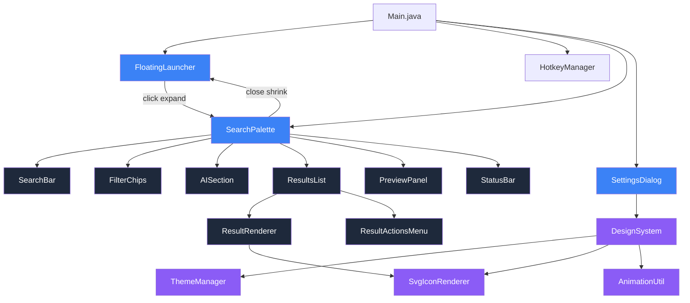

# FileMind Redesign Plan

## Design Audit: Current State vs. Target Vision

### Critical Issues Identified

| # | Issue | Current State | Target State | Priority |
|---|-------|--------------|--------------|----------|
| 1 | **Dim Layer** | Full-screen overlay (#0f172a at 55% opacity) | NO dimming - palette expands from launcher | 🔴 P0 |
| 2 | **Floating Launcher** | 48px navy circle + emoji + pulse scale | SVG icon + glowing border + breathing + expand animation | 🔴 P0 |
| 3 | **Search Opening** | Centered fade + slide with dim behind | Scale-up from launcher position, no dimming | 🔴 P0 |
| 4 | **Search Bar** | Basic: emoji + field + theme toggle + esc | Voice icon + AI icon + settings + keyboard hint | 🟠 P1 |
| 5 | **Results Icons** | Text badges (PD, JV, PY) with colored bg | SVG file-type icons (PDF, Word, Excel, etc.) | 🟠 P1 |
| 6 | **AI Section** | Only NL hint text | Dedicated AI suggestion cards section | 🟠 P1 |
| 7 | **Filter Chips** | Category tabs (JButtons text only) | Pill-shaped filter chips with icons | 🟠 P1 |
| 8 | **Preview (Space)** | Not implemented | macOS Finder-style quick-look preview | 🟡 P2 |
| 9 | **Settings** | JTabbedPane with basic layout | Beautiful card-based settings | 🟡 P2 |
| 10 | **Design System** | No reusable components | Typography, spacing, shadows, animations system | 🟠 P1 |

---

## Design Rationale

### 1. Floating Launcher → Search Palette (No Dimming)

**Why it exists**: The user should never feel like a modal dialog has taken over their screen. By expanding the search palette directly from the floating launcher, we preserve context. The user sees their desktop behind the semi-transparent palette, maintaining awareness of their workspace.

**User Experience**: 
- Launcher sits quietly in bottom-right (or user's chosen position)
- On click: the launcher "morphs" into the search palette via a scale + translate animation
- The palette appears as a floating card with backdrop filter blur (simulated via slight transparency)
- On close: palette shrinks back into the launcher position

**Edge Cases**:
- If launcher is near screen edge, palette expands inward
- Multi-monitor: palette opens on the monitor containing the launcher
- If palette would overflow, adjust position

**Visual Hierarchy**:
- Launcher is the "seed" - small, unassuming
- Palette is the "bloom" - full-featured but always feels connected to the launcher

### 2. SVG File Type Icons

**Why it exists**: Emoji are inconsistent across platforms and lack the precision needed for a professional tool. Custom SVG icons ensure every file type is visually distinct and premium-looking.

**Icon Design Principles**:
- 16x16 or 20x20 viewBox
- Minimal, single-color outlined style (filled variant for selected state)
- Consistent stroke width (1.5px)
- Each icon uses an accent color specific to its type (e.g., PDF=red, Code=blue, Image=purple)

### 3. AI Section as Dedicated Space

**Why it exists**: AI-powered suggestions differentiate FileMind from traditional search. By reserving a visual section, we communicate that AI is a core feature, not an afterthought. The section appears when:
- Search is empty (shows smart suggestions)
- Natural language is detected (shows interpretation)

**What's shown**:
- Empty state: "✨ AI Suggestions" with contextual cards
- During search: Parsed query chips + AI interpretation

### 4. Filter Chips Over Tabs

**Why it exists**: Chips are more tactile, visually distinct, and feel modern. They communicate "filtering the current results" rather than "switching to a different view." Chips can be multi-select (future) and are easier to scan.

---

## Component Architecture

```
┌────────────────────────────────────────────────────┐
│                 SearchPalette                       │
│  ┌──────────────────────────────────────────────┐  │
│  │           SearchBar (52px)                    │  │
│  │  [🔍] [Search anything...] [🎤] [✨] [⚙️]   │  │
│  │                              [Ctrl+K] [esc]   │  │
│  └──────────────────────────────────────────────┘  │
│  ┌──────────────────────────────────────────────┐  │
│  │           FilterChips (36px)                  │  │
│  │  [All] [Files] [Folders] [Images] [Videos]   │  │
│  │  [Code] [PDF] [Office] [Recent] [Pinned] [★] │  │
│  └──────────────────────────────────────────────┘  │
│  ┌──────────────────────────────────────────────┐  │
│  │           AISection (optional, ~80px)         │  │
│  │  ✨ AI Suggestions                            │  │
│  │  [Find PDF edited yesterday] [Open Java...]   │  │
│  └──────────────────────────────────────────────┘  │
│  ┌──────────────────────────────────────────────┐  │
│  │           ResultsList (scrollable, max 400px) │  │
│  │  ┌────────────────────────────────────────┐  │  │
│  │  │ [📄] report.pdf    ~/docs     2MB  dec1  │  │  │
│  │  │ [☕] Main.java     src/       4KB  dec2  │  │  │
│  │  │ [🖼️] photo.png    ~/Pictures  1MB  dec3  │  │  │
│  │  └────────────────────────────────────────┘  │  │
│  └──────────────────────────────────────────────┘  │
│  ┌──────────────────────────────────────────────┐  │
│  │           StatusBar (24px)                    │  │
│  │  12 results    ↑↓ navigate ↵ open ␣ preview   │  │
│  └──────────────────────────────────────────────┘  │
└────────────────────────────────────────────────────┘
```

---

## Detailed Task List

### Phase 1: Foundation (Design System)

#### Task 1.1: Create DesignSystem.java
- Reusable color palette (primary, secondary, accent, surface, text, border)
- Typography definitions (font families, sizes, weights, line heights)
- Spacing scale (4px grid: 4, 8, 12, 16, 20, 24, 32, 48)
- Corner radius tokens (4, 8, 12, 16, rounded-full)
- Shadow definitions (elevation levels 1-5)
- Animation curves (ease-in-out, ease-out, spring) and durations
- Breakpoints for High DPI support

#### Task 1.2: Create SvgIconRenderer.java
- SVG icon rendering system for file types
- Icons to create: PDF, Word, Excel, Image, Video, Folder, Java, Python, ZIP, Audio, Executable, Text, HTML, Markdown, Generic File, Search, Voice, AI, Settings, Star, Pin, Clock
- Support for dark/light mode icon variants
- Support for selected/hover states
- 16x16 viewBox with 1.5px stroke

#### Task 1.3: Create ThemeManager.java (Enhanced)
- Extend existing ThemeManager with design token integration
- Add "Automatic" theme option (follows OS)
- Add surface colors for cards, hover, selected states
- Add glass-morphism support (backdrop-filter simulation)
- High DPI awareness

### Phase 2: Core UI Components

#### Task 2.1: Redesign FloatingLauncher.java (replaces FloatingIcon.java)
- Smaller footprint (32px or 36px)
- Custom SVG magnifying glass icon (drawn with Graphics2D)
- Animated glowing border (gradient that rotates)
- Soft breathing opacity animation (0.85 → 1.0 over 3s sine wave)
- Hover: glow intensity increases, slight scale (1.05x)
- Click: triggers expand animation (does not open SearchPanel separately)
- Drag support with position persistence
- Context menu: Open, Settings, About, Exit

#### Task 2.2: Create SearchPalette.java (replaces SearchPanel.java)
- JWindow with NO dim layer
- Opens with expand animation from FloatingLauncher position
- Closes with shrink animation back to FloatingLauncher position
- Fixed width: 640px (slightly narrower than current 680px)
- Max height: 520px (same as current)
- Rounded corners: 16px
- Border: subtle 1px with 0.5 alpha
- Shadow: elevation level 4
- Backdrop: slight transparency (simulate glass effect)
- Sections: SearchBar, FilterChips, AISection, ResultsList, StatusBar

#### Task 2.3: Redesign SearchBar
- Left: Search icon (SVG, not emoji)
- Center: JTextField with "Search anything..." placeholder
- Right icon row: Voice (🎤 SVG) | AI (✨ SVG) | Settings (⚙️ SVG)
- Far right: Keyboard shortcut hint badge ("Ctrl+K")
- Far right: Close hint ("esc")
- Height: 52px
- No border on text field (clean look)
- Typography: 16px Inter/System font, medium weight

#### Task 2.4: Create FilterChips.java (replaces tab bar)
- Pill-shaped JToggleButton array
- Chips: All, Files, Folders, Images, Videos, Code, PDF, Office, Recent, Pinned, Favorites
- Active chip: filled accent color (#3b82f6), white text
- Inactive chip: subtle surface fill, primary text
- Keyboard: Tab/Shift+Tab to cycle, Ctrl+1-9 for direct access
- Horizontal scroll if chips overflow (with fade gradient at edges)

#### Task 2.5: Create AISection.java
- Collapsible section below filter chips
- Shows only when: (a) search is empty, or (b) NL query detected
- Empty state: "✨ AI Suggestions" header + 3 suggestion cards
- Suggestion card: icon + text, clickable, subtle hover lift
- During NL query: shows interpretation + confidence indicator
- Cards example: "Find the PDF edited yesterday", "Open my Java project", "Show invoices from last month", "Summarize this folder"

#### Task 2.6: Create PreviewPanel.java
- Activated by Space key on selected result
- macOS Finder-style Quick Look overlay
- Shows: large file icon (SVG), filename, path, size, modified date
- For images: downscaled preview
- For text/code: first 50 lines with syntax coloring
- For PDF: page count, not content
- For video/audio: duration, codec info
- Dismiss: Space again, Escape, or click outside

### Phase 3: Results & Interaction

#### Task 3.1: Redesign Results Rendering
- Each result row: 56px height (up from 42px)
- Layout:
  - Left: SVG file icon (24x24) with type color
  - Center-left: Filename (14px semibold)
  - Center: Parent path (11px, secondary text)
  - Right: File size (11px)
  - Far right: Modified time (11px, smart formatted)
- Quick actions: appears on hover (🔍 preview, 📋 copy, 📂 open folder)
- Selection: 2px left accent border + subtle background tint
- Hover: background tint transition (100ms)
- Section headers: uppercase, 10px tracking, with thin separator line

#### Task 3.2: Create ResultActionsMenu.java
- Inline quick actions on each result row
- Visible on hover
- Icons: Preview (Space), Copy Path (Ctrl+C), Open Folder (Ctrl+Enter), Pin, Favorite
- Popup on right-click: full context menu
- Support for "Rename to suggested" if NameSuggester provides

#### Task 3.3: Enhance Keyboard Navigation
- Arrow keys with smooth scrolling
- Page Up/Down for faster navigation
- Home/End for first/last result
- Space for preview (if not in search field)
- Tab/Shift+Tab for filter chip cycling
- Ctrl+1-9 for direct chip access
- Escape hierarchy: close preview → clear search → close palette

### Phase 4: Settings & Polish

#### Task 4.1: Redesign SettingsDialog.java
- Card-based layout (no JTabbedPane)
- Cards:
  - **General**: Theme (Dark/Light/Auto), Launch on startup, Hotkey customizer
  - **Search**: Index folders, Excluded paths, Max file size, File type filters
  - **Appearance**: Accent color picker, Font size, Reduced motion toggle
  - **Privacy**: Anonymize file paths, Clear history, Disable indexing toggle
  - **About**: Version, Credits, License, Update check
- Each card: rounded corners (12px), subtle shadow, icon header
- Settings are persisted to ~/.filemind/config.properties

#### Task 4.2: Add Accessibility Features
- All controls keyboard-reachable
- Focus indicators visible (2px outline)
- ARIA-like labels for screen readers (set tooltips/accessible names)
- Respect system "Reduce motion" setting (disable animations)
- High contrast mode detection
- Minimum contrast ratio compliance (4.5:1 for text)

#### Task 4.3: Animation Pass
- Floating launcher: breathing (3s sine), glow rotation (6s linear)
- Open palette: scale from launcher (200ms spring), content fade-in (150ms staggered)
- Filter chip change: smooth color transition (100ms)
- Result hover: background shift (100ms)
- Result selection: border slide-in (80ms)
- Preview open: scale-up from result (150ms)
- Preview close: scale-down and fade (100ms)
- Settings: card reveal stagger (100ms each)
- All animations respect "Reduce motion"

### Phase 5: Polish & Cleanup

#### Task 5.1: Clean Up Old Code
- Remove DimLayer.java (no more dimming)
- Remove SearchUI.java (fully replaced by SearchPalette)
- Remove ResultItem.java / ResultListModel.java (replaced by new rendering)
- Remove or merge SearchPanel.java into SearchPalette
- Remove old FloatingIcon.java

#### Task 5.2: Visual Polish
- Verify all components use DesignSystem tokens
- Check all states: default, hover, active, focus, disabled
- Verify dark/light mode consistency
- Test at various font sizes and DPI settings
- Verify animations are smooth (no jank)
- Check edge cases: 0 results, 1000+ results, very long filenames

---

## Mermaid: Component Relationship



---

## File Change Summary

### New Files to Create
1. `src/main/java/com/recall/ui/design/DesignSystem.java`
2. `src/main/java/com/recall/ui/design/SvgIconRenderer.java`
3. `src/main/java/com/recall/ui/design/FilterChips.java`
4. `src/main/java/com/recall/ui/FloatingLauncher.java`
5. `src/main/java/com/recall/ui/SearchPalette.java`
6. `src/main/java/com/recall/ui/AISection.java`
7. `src/main/java/com/recall/ui/PreviewPanel.java`
8. `src/main/java/com/recall/ui/ResultActionsMenu.java`
9. `src/main/java/com/recall/ui/ResultRenderer2.java` (replacement)

### Files to Modify
1. `src/main/java/com/recall/ui/ThemeManager.java` - Enhanced with design tokens
2. `src/main/java/com/recall/ui/AnimationUtil.java` - Add spring easing, reduce-motion support
3. `src/main/java/com/recall/ui/SettingsDialog.java` - Card-based redesign
4. `src/main/java/com/recall/Main.java` - Update to use new components

### Files to Remove
1. `src/main/java/com/recall/ui/DimLayer.java`
2. `src/main/java/com/recall/ui/FloatingIcon.java`
3. `src/main/java/com/recall/ui/SearchUI.java`
4. `src/main/java/com/recall/ui/SearchPanel.java`
5. `src/main/java/com/recall/ui/ResultItem.java`
6. `src/main/java/com/recall/ui/ResultListModel.java`
7. `src/main/java/com/recall/ui/ResultRenderer.java`

---

## Implementation Order

The implementation should proceed in this order:

1. **DesignSystem.java** + Enhanced **ThemeManager.java** (all other components depend on this)
2. **SvgIconRenderer.java** (results need icons, search bar needs icons)
3. **AnimationUtil.java** enhancement (prep for smooth transitions)
4. **FloatingLauncher.java** (the entry point - replaces FloatingIcon)
5. **SearchPalette.java** (the main interface - replaces SearchPanel)
6. **FilterChips.java** (inside palette)
7. **AISection.java** (inside palette)
8. **ResultRenderer2.java** (results with SVG icons, inside palette)
9. **ResultActionsMenu.java** (quick actions on results)
10. **PreviewPanel.java** (Space key preview)
11. **SettingsDialog.java** redesign
12. **Main.java** update + cleanup old files
13. Animation pass and visual polish
